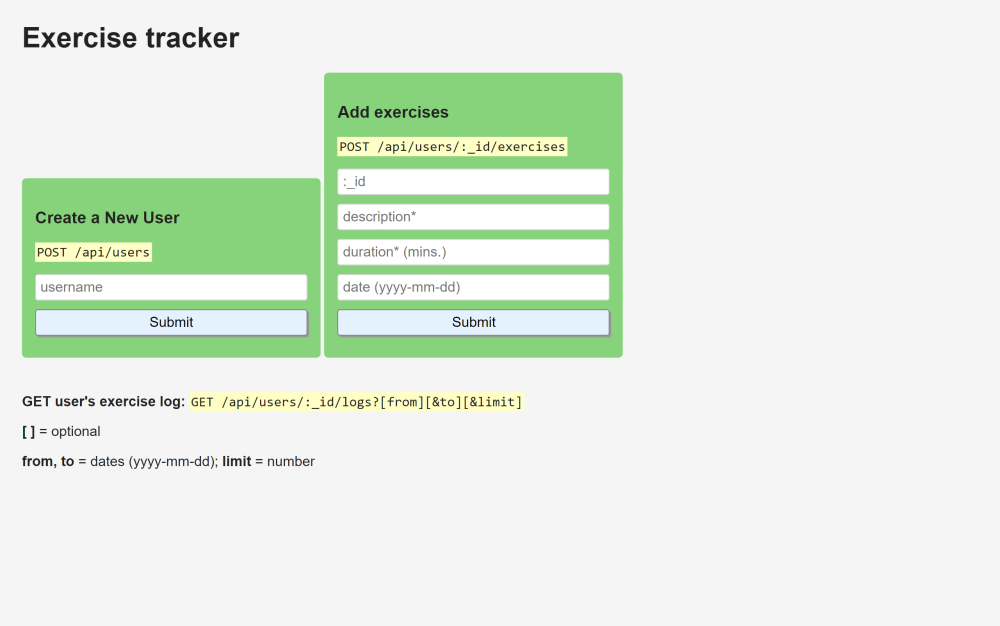

# [freeCodeCamp Back End Development and APIs certification](https://www.freecodecamp.org/learn/back-end-development-and-apis/)

## [File Metadata Microservice project](https://www.freecodecamp.org/learn/back-end-development-and-apis/back-end-development-and-apis-projects/exercise-tracker)

Working example: https://exercise--tracker--project.herokuapp.com/

My git repo: https://github.com/Raff1010X/01.Roadmap

